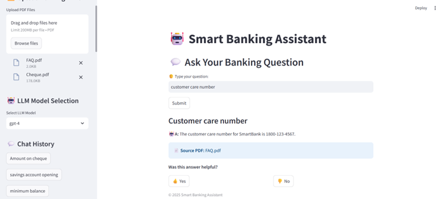

# 🏦 Smart Banking Assistant (Hybrid RAG with ChromaDB & Graph Retrieval)

A Streamlit-based AI Banking Assistant that answers banking-related questions using **PDF documents**, **Neo4j Graph Retrieval**, and **Hybrid RAG**. Supports:

👉 Multiple PDF upload & automatic ingestion\
👉 OCR for image-based PDFs (Tesseract enabled)\
👉 Hybrid RAG with ChromaDB + Neo4j\
👉 Chat History for 30 days\
👉 Feedback buttons (Thumbs up / down)\
👉 Human & Robot emoji styling for better UX

---

## 📸 Demo Screenshots

### 🖥️ Banking Assistant UI


### 📄 PDF Upload Example


---

## 📁 Project Structure

```
Smart Bank/
├── app.py                     # Main Streamlit UI
├── graph_loader.py            # Neo4j graph processing
├── rag_module.py              # RAG logic combining ChromaDB & Neo4j
├── llm_selector.py            # Model selection logic
├── ingestion/
│   └── pdf_loader.py          # PDF & Image chunking with OCR
├── vectordb/                  # ChromaDB persistent storage
├── chat_history.pkl           # Stored chat history (auto-generated)
├── .env                       # Secrets (Neo4j, OpenAI keys)
├── requirements.txt           # All Python dependencies
└── README.md                   # Project Documentation
```

---

## 🚀 Features

- Upload multiple PDF banking documents
- Automatic chunking of both text & image-based PDFs (via Tesseract)
- Neo4j stores graph-based policy data with full-text index
- ChromaDB stores text chunks for fast semantic retrieval
- Hybrid RAG combines Neo4j + ChromaDB context for better answers
- 30-day chat history stored locally
- LLM model selection (GPT-4, GPT-4o, GPT-3.5, LLaMA3, Mistral, etc.)
- Feedback buttons for each answer
- Human & Robot emoji UI improvements

---

## ⚙️ Setup Instructions

1. **Clone Repository**

```bash
git clone https://github.com/your-username/smart-banking-assistant.git
cd smart-banking-assistant
```

2. **Create Virtual Environment**

```bash
conda create -n venv-gc python=3.11
conda activate venv-gc
```

3. **Install Dependencies**

```bash
pip install -r requirements.txt
```

4. **Install Tesseract OCR**

- [Download Tesseract](https://github.com/tesseract-ocr/tesseract/releases)
- Add `C:\Program Files\Tesseract-OCR` to your PATH
- Verify with:

```bash
tesseract --version
```

5. \*\*Setup \*\*``

Create `.env` file:

```ini
NEO4J_URI=bolt://localhost:7687
NEO4J_USERNAME=your_neo4j_username
NEO4J_PASSWORD=your_neo4j_password
OPENAI_API_KEY=your_openai_api_key
```

---

## 💻 Run the Application

```bash
streamlit run app.py
```

Access at: [http://localhost:8501](http://localhost:8501)

---

## 🧠 Technologies Used

- **Streamlit** - UI
- **ChromaDB** - Vector storage for PDFs
- **Neo4j** - Graph database for banking policy nodes
- **OpenAI/LLM** - Answer generation
- **Tesseract OCR** - Image-based PDF processing
- **LangChain** - Embedding + retrieval utilities

---

## ✅ To-Do / Future Enhancements

- Vector-based image chunking improvement
- Admin panel for PDF management
- Secure backend API layer with FastAPI
- Azure/AWS cloud deployment

---

## 📢 Credits

Developed by Nandini GC for Smart Banking AI Assistant with GraphRAG & Document Retrieval.

